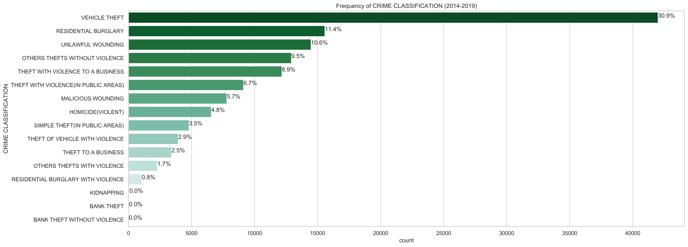
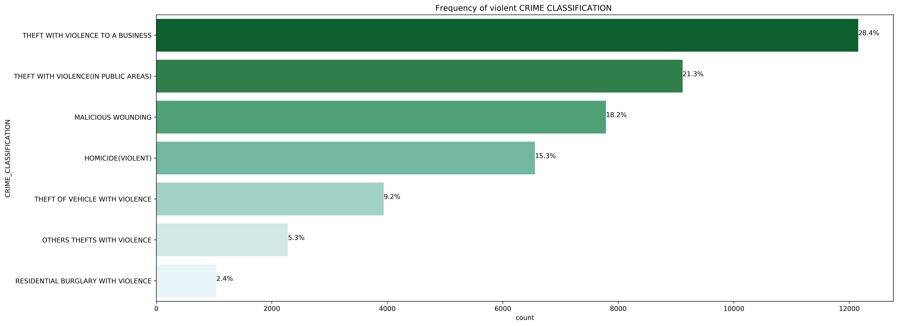
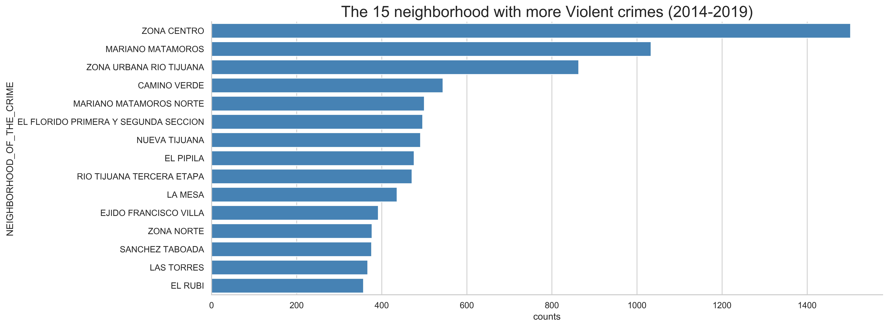
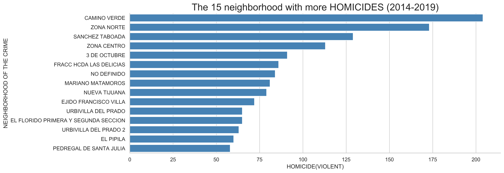
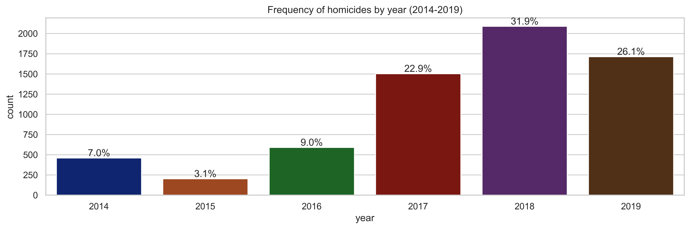
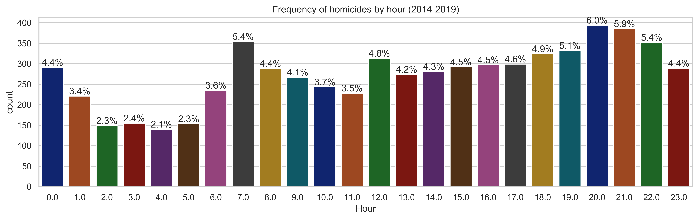
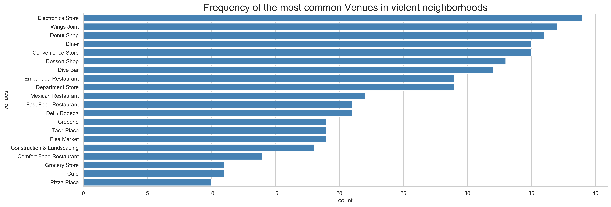

# Violence and local business in the city of Tijuana

### Abstract
I analyzed the violence in the city of Tijuana and its effect on local business. I used data science methods to analyze the crime data, dividing the city into high crime zones. I compared this information to the number of local businesses in the city, finding a diminution of local business in the high crime zones.

### Introduction
Tijuana is one of Mexico's most prominent and fastest-growing cities, and it is the home of 3.4 million people in 2014,  making it the largest Mexican city on the U.S.-Mexico border.  The city's proximity to Southern California and its large, skilled, diverse, and relatively inexpensive workforce make it an attractive city for foreign companies looking to establish extensive industrial parks composed of assembly plants called "maquiladoras". According to a recent study in 2018 by the National Council for the Evaluation of Social Development Policy (CONEVAL, for his name in Spanish),  almost 70 % of the population lives in poverty conditions. There are lots of jobs but meager wages and poor conditions for Social mobility. 

Given the city's geographic point, a rise in violence related to drug trafficking and organized crime groups has been seen in the past decades.  The city also has high levels of drug use shaped by its proximity to the United States, but still, there is no analysis or even data of the real problem.  Drug violence continues to dominate in Tijuana, wherein 2017 had more homicides than any other city in Mexico. In a record year for national homicide figures, in 2017, one out of twenty murders in Mexico took place in Tijuana. There is not a concise analysis of the violence in the city from the government. This work is the start of what I hope becomes that analysis, starting with a focus on the effect of the violence on the local business. 

### Results

Frecuency of crime classification in period 2014-2019:

The state of Baja California is the first place in vehicle theft in the country, and it is not surprisingthat in Tijuana the numbers of this crime are so big.  An analysis of each crime is of importance, but in thiswork, the focus will be on violent crimes, especially theft to business with violence and homicides.  So, we candivide the data just with violent crimes as follows:

- Homicide (Violent)
- Malicious wounding
- Residential burglary with violence
- Robbery with violence (public areas)
- Theft with violence to a bussiness
- Theft of vehicle with violence
- Other robberies with violence

Violent crimes are only the 31.49 % of the total crimes presented in the data, but this type of crimesare the ones that affect more the life in the city

Frequency of violent crimes in the period 2014-2019:

The most violent neighborhoods :

**Interactive map that show the 100 most violent neighborhoods and the number of violent crimes in each one:** [Interactive map](https://rawcdn.githack.com/victor-onofre/Capstone-Project/b53d7076d87109d42c45ad870a382c22f88cf2f1/violent_crimes_Tijuana.html).

#### Homicides

The neighborhoods with the highest number of homicides:

**Interactive Map that show the number of homicides in the 100 more violent neighborhoods, the intensity of redmeans more homicides in that area:** [Interactive map](https://rawcdn.githack.com/victor-onofre/Capstone-Project/b53d7076d87109d42c45ad870a382c22f88cf2f1/Homicides_Tijuana.html).

 Frequency of homicides by year and hour:
 

 

#### Local businesses

Frequency of the more common venues in violent neighborhoods:

**Interactive Map of the clusters of the most common venues in the violent neighborhoods of the city.  The purple and red dots are mostly restaurants and bars, the green dots are mostly convenience stores:** [Interactive map](https://rawcdn.githack.com/victor-onofre/Capstone-Project/39f0420ff1e9ce2b927cb1e84ed77fa58d5c8da2/Venues_Clusters_Tijuana.html).
